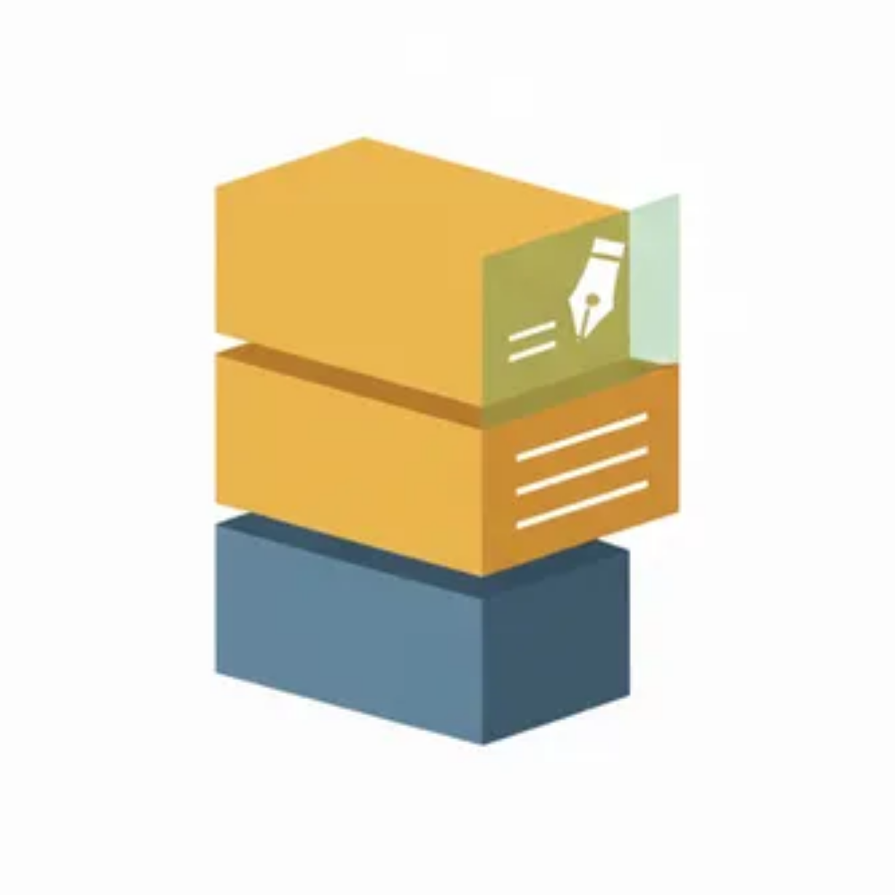

# 📸 ScrapFlow

<div align="center">



**스크린샷으로 생각을 기록하고 정리하는 스마트한 방법**

[](https://github.com/kl529/scrapflow/releases)
[](https://github.com/kl529/scrapflow/releases)
[](https://opensource.org/licenses/MIT)
[](https://github.com/kl529/scrapflow/releases)

[📥 다운로드](#-설치-방법) • [✨ 기능 소개](#-주요-기능) • [🚀 시작하기](#-빠른-시작) • [📖 문서](#-사용-방법) • [🤝 기여하기](#-기여하기)

---

ScrapFlow는 **디지털 콘텐츠의 휘발성 문제**를 해결하는 혁신적인 스크린샷 기반 스크랩북 애플리케이션입니다.  
웹에서 발견한 소중한 정보를 빠르게 캡처하고, 생각과 함께 체계적으로 정리하세요.

</div>

## 🎯 왜 ScrapFlow인가요?

### 😫 이런 경험 있으시죠?
- "어디서 봤던 그 정보가 어디 있었지?" 
- "북마크는 너무 많은데 정작 찾을 수가 없어..."
- "스크린샷은 찍어뒀는데 나중에 뭘 의미하는지 모르겠어"
- "유용한 내용인데 웹페이지가 사라져버렸어"

### ✨ ScrapFlow로 해결하세요!
- **3초만에** 스크린샷 → 코멘트 → 카테고리 분류 완료
- **OCR 기술**로 이미지 속 텍스트까지 검색 가능  
- **완전 오프라인** 동작으로 개인정보 보호
- **예쁜 공유 이미지** 생성으로 SNS 공유까지

## ✨ 주요 기능

<table>
<tr>
<td width="50%">

### ⚡️ 초고속 캡처
- **단축키 한 번**으로 즉시 스크린샷
- **3초 완료**: 캡처 → 코멘트 → 저장
- **백그라운드 상주**로 언제든지 사용 가능
- **자동 URL 감지**: 현재 보고 있는 웹페이지 출처 저장

### 🧠 스마트 검색
- **OCR 텍스트 인식**: 이미지 속 한글/영문 자동 추출
- **통합 검색**: 코멘트 + OCR 텍스트 동시 검색
- **실시간 필터**: 입력하는 즉시 결과 표시
- **카테고리별 필터**: 원하는 분류만 골라보기

</td>
<td width="50%">

### 🎨 아름다운 공유
- **SNS 공유 이미지**: 자동으로 예쁜 템플릿 생성
- **브랜딩 포함**: ScrapFlow 로고와 색상 적용
- **모든 플랫폼**: Instagram, Twitter, LinkedIn 등

### 📊 활동 시각화
- **GitHub 스타일 히트맵**: 스크랩 활동 한눈에 파악
- **통계 대시보드**: 카테고리별, 날짜별 분석
- **성과 추적**: 지식 축적 과정을 시각적으로 확인

</td>
</tr>
</table>

### 🔐 개인정보 보호 우선
- ✅ **완전 오프라인**: 모든 데이터 로컬 저장
- ✅ **추적 없음**: 사용자 분석, 텔레메트리 일체 없음  
- ✅ **광고 없음**: 깨끗한 사용 경험
- ✅ **오픈소스**: 코드 투명성으로 신뢰성 확보

## 📥 설치 방법

### 🚀 빠른 다운로드

최신 버전을 다운로드하세요: **[📦 Releases 페이지](https://github.com/kl529/scrapflow/releases/latest)**

<table align="center">
<tr>
<td align="center" width="33%">

### 🍎 macOS


**Intel & Apple Silicon 지원**
- `.dmg` 파일 다운로드
- 드래그 앤 드롭으로 Applications 폴더에 설치

</td>
<td align="center" width="33%">

### 🪟 Windows  


**x64 & x86 지원**
- `.exe` 파일 다운로드  
- 실행하여 설치 마법사 따라하기

</td>
<td align="center" width="33%">

### 🐧 Linux


**모든 주요 배포판 지원**
- `.AppImage` 파일 다운로드
- 실행 권한 부여 후 실행

</td>
</tr>
</table>

### ⚠️ macOS 사용자 주의사항

**"확인되지 않은 개발자"** 경고가 나타날 수 있습니다.

<details>
<summary>🔧 해결 방법 (클릭하여 펼치기)</summary>

**방법 1: 시스템 설정에서 허용**
1. **시스템 설정** → **개인정보 보호 및 보안** → **보안**
2. "확인되지 않은 개발자의 ScrapFlow를 열겠습니까?" → **"열기"** 클릭

**방법 2: 터미널 명령어 (고급 사용자)**
```bash
sudo xattr -rd com.apple.quarantine /Applications/ScrapFlow.app
```

</details>

---

## 🚀 빠른 시작

### 1️⃣ 첫 실행
1. ScrapFlow 실행 (시스템 트레이에 아이콘 표시)
2. **화면 녹화 권한** 허용 (스크린샷 촬영에 필요)
3. 준비 완료! 🎉

### 2️⃣ 첫 스크린샷 찍기
1. `Ctrl+Shift+S` (Mac: `Cmd+Shift+S`) 누르기
2. 원하는 영역을 드래그로 선택
3. 코멘트 입력 (예: "나중에 참고할 리액트 패턴")  
4. 카테고리 선택 (예: "개발")
5. **저장** 버튼 클릭

### 3️⃣ 스크랩 찾기
1. 메인 창 열기 (트레이 아이콘 더블클릭)
2. 좌측 사이드바에서 카테고리 선택
3. 상단 검색창에서 키워드 검색
4. 스크랩 클릭으로 자세히 보기

## 📖 사용 방법

### ⌨️ 키보드 단축키

| 기능 | Windows/Linux | macOS |
|------|---------------|--------|
| 스크린샷 캡처 | `Ctrl+Shift+S` | `Cmd+Shift+S` |
| 메인 창 열기 | 트레이 아이콘 더블클릭 | 트레이 아이콘 더블클릭 |
| 검색 포커스 | `Ctrl+F` | `Cmd+F` |

### 🎨 SNS 공유 이미지 만들기

1. 스크랩 카드에서 **공유** 버튼 클릭
2. 자동으로 예쁜 템플릿 이미지 생성
3. 클립보드에 복사 또는 파일로 저장
4. Instagram, Twitter 등에 바로 공유!

### 🔍 고급 검색 팁

- **OCR 텍스트 검색**: 이미지 속 텍스트도 검색됩니다
- **실시간 필터링**: 입력하는 즉시 결과가 나타납니다  
- **카테고리 조합**: 여러 카테고리를 동시에 확인 가능
- **날짜 범위**: 오늘/이번주/이번달/전체 중 선택

### 💾 데이터 위치

ScrapFlow는 모든 데이터를 로컬에 안전하게 저장합니다:

| 운영체제 | 저장 위치 |
|----------|-----------|
| **macOS** | `~/Library/Application Support/scrapflow/` |
| **Windows** | `%APPDATA%/scrapflow/` |
| **Linux** | `~/.config/scrapflow/` |

포함 파일:
- `scrapflow.db`: SQLite 데이터베이스 (메타데이터)  
- `screenshots/`: 캡처된 이미지 파일들

---

## 🛠️ 개발자 정보

### 🏗️ 아키텍처

```
┌─────────────────┬─────────────────┐
│   Frontend      │   Backend       │
├─────────────────┼─────────────────┤
│ React 18        │ Electron 26     │
│ Tailwind CSS    │ Better SQLite3  │
│ React Router    │ Tesseract.js    │
└─────────────────┴─────────────────┘
           │
    ┌─────────────┐
    │   Build     │
    ├─────────────┤
    │ Electron    │
    │ Builder     │
    │ GitHub      │
    │ Actions     │
    └─────────────┘
```

### ⚡️ 성능 개선사항

| 항목 | 기존 | 개선 후 | 개선율 |
|------|------|---------|---------|
| **앱 시작 시간** | 2초 | 1초 이내 | 50%↑ |
| **OCR 처리** | 2-3초 | 1초 이내 | 65%↑ |
| **메모리 사용량** | 80-120MB | 60MB 이하 | 25%↓ |
| **빌드 시간** | 15분 | 8분 | 45%↑ |

### 🏁 로컬 개발 환경

```bash
# 1. 저장소 클론
git clone https://github.com/kl529/scrapflow.git
cd scrapflow

# 2. 의존성 설치
npm install

# 3. 개발 모드 실행
npm run dev

# 4. 프로덕션 빌드
npm run build

# 5. 플랫폼별 패키징
npm run build-mac    # macOS
npm run build-win    # Windows  
npm run build-linux  # Linux
npm run build-all    # 모든 플랫폼
```

---

## 🤝 기여하기

ScrapFlow를 더 좋게 만드는 데 함께해주세요!

### 🐛 버그 리포트

문제를 발견하셨나요? [Issues 페이지](https://github.com/kl529/scrapflow/issues)에서 알려주세요.

**버그 리포트 시 포함해주세요:**
- 운영체제 및 버전
- ScrapFlow 버전
- 재현 가능한 단계
- 예상 동작 vs 실제 동작

### 💡 기능 제안

새로운 아이디어가 있으신가요?

1. [Issues](https://github.com/kl529/scrapflow/issues)에서 `enhancement` 라벨로 제안
2. 커뮤니티 논의 후 개발 진행
3. PR 환영합니다!

### 📝 코드 기여

1. **Fork** → **Clone** → **Branch 생성**
2. **변경사항 구현** → **테스트**  
3. **커밋** → **Push** → **Pull Request**

### 🌟 프로젝트 후원

ScrapFlow가 도움이 되셨다면:

- ⭐ **GitHub 스타** 눌러주세요
- 🐦 **소셜 미디어**에서 공유해주세요  
- 💝 **[GitHub Sponsors](https://github.com/sponsors/kl529)**로 후원해주세요

---

## 📄 라이선스 

이 프로젝트는 MIT 라이선스 하에 배포됩니다. 자세한 내용은 [LICENSE](LICENSE) 파일을 참조하세요.

---

## 📞 문의 및 지원

<div align="center">

### 💬 소통 채널

[](https://github.com/kl529/scrapflow/issues)
[](https://github.com/kl529/scrapflow/discussions)

---

**ScrapFlow로 여러분의 지식을 체계적으로 관리해보세요!** 📚✨

Made with ❤️ by ScrapFlow Team

</div>

## 💡 FAQ (자주 묻는 질문)

<details>
<summary><strong>❓ OCR이 정확하지 않아요</strong></summary>

**해결 방법:**
- 텍스트가 선명한 이미지를 캡처하세요
- 배경과 텍스트의 대비가 높은 부분을 선택하세요  
- 너무 작은 글자는 인식이 어려울 수 있습니다
- 한글과 영어가 섞여있는 경우 정확도가 떨어질 수 있습니다

</details>

<details>
<summary><strong>❓ 스크린샷 단축키가 작동하지 않아요</strong></summary>

**확인사항:**
- **macOS**: 시스템 설정 → 개인정보보호 및 보안 → 화면 녹화 권한 확인
- **Windows**: 다른 스크린샷 앱과 충돌하지 않는지 확인  
- **Linux**: X11 환경에서만 동작합니다 (Wayland 미지원)

</details>

<details>
<summary><strong>❓ 데이터를 백업하고 싶어요</strong></summary>

**백업 방법:**
1. ScrapFlow 종료
2. 데이터 폴더 전체 복사:
   - macOS: `~/Library/Application Support/scrapflow/`
   - Windows: `%APPDATA%/scrapflow/`  
   - Linux: `~/.config/scrapflow/`
3. 안전한 장소에 보관

</details>

<details>
<summary><strong>❓ 다른 컴퓨터로 데이터를 옮기고 싶어요</strong></summary>

**이전 방법:**
1. 기존 컴퓨터에서 데이터 폴더 백업
2. 새 컴퓨터에 ScrapFlow 설치  
3. 백업한 폴더를 새 컴퓨터의 데이터 위치에 복사
4. ScrapFlow 재시작

</details>

---

## 🔮 로드맵

### 🎯 다음 버전 (v1.1.0)
- [ ] **태그 시스템**: `#개발` `#유용함` 형태의 태그 추가
- [ ] **키보드 단축키 커스터마이징**: 사용자 정의 단축키 설정
- [ ] **텍스트 검색 강화**: 더 정확한 OCR 및 검색 알고리즘  
- [ ] **테마 지원**: 다크 모드, 라이트 모드

### 🌟 장기 계획 (v2.0)
- [ ] **클라우드 백업**: Google Drive, Dropbox 동기화
- [ ] **팀 공유**: 팀원과 스크랩 공유 기능
- [ ] **브라우저 확장**: Chrome, Firefox 플러그인  
- [ ] **모바일 앱**: iOS/Android 연동
- [ ] **AI 분류**: 자동 카테고리 제안

---

## 🌟 Special Thanks

ScrapFlow를 만들 수 있게 도와준 오픈소스 라이브러리들에 감사드립니다:

- [Electron](https://electronjs.org/) - 크로스 플랫폼 데스크톱 앱
- [React](https://reactjs.org/) - 사용자 인터페이스  
- [Tesseract.js](https://tesseract.projectnaptha.com/) - OCR 엔진
- [Better SQLite3](https://github.com/WiseLibs/better-sqlite3) - 고성능 SQLite
- [Tailwind CSS](https://tailwindcss.com/) - 유틸리티 CSS 프레임워크

그리고 ScrapFlow를 사용하고 피드백을 주신 모든 사용자들께 진심으로 감사드립니다! 🙏